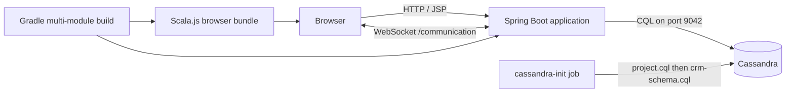

# JVM CRM Platform

> Working repository name: `dawson-crm`

This project is evolving from a real-time chat application into a JVM-first customer relationship management (CRM) platform. The existing account, role, conversation, live-message, moderation, and event foundations are intended to become the collaboration layer around organizations, contacts, leads, deals, tasks, notes, activities, and teams.

The target product is a multi-workspace CRM in which a team can manage its customer lifecycle, collaborate around customer records, follow a sales pipeline, schedule work, receive actionable notifications, and retain a unified activity history. The current product is not production-ready: chat and basic account workflows are partially functional, the CRM tables are schema-only, and several security and application workflows remain to be built.

The primary runnable path is the Spring Boot/JSP/Scala.js application. A separate Kotlin Multiplatform/Kobweb authentication UI is experimental and is not part of the main Docker Compose runtime.

## Product vision

The intended end state is one cohesive CRM with five connected capabilities:

1. **Customer records** — organizations and contacts with ownership, lifecycle state, communication preferences, relationships, notes, and custom fields.
2. **Sales execution** — lead intake and qualification, configurable pipelines, opportunities, stage movement, forecasts, win/loss outcomes, and lead conversion.
3. **Work management** — assignable tasks, reminders, due-date views, team ownership, and work linked to any CRM record.
4. **Communication and collaboration** — record-linked conversations, real-time internal chat, mentions, customer interaction history, and administrative moderation.
5. **Events and notifications** — durable domain events that drive an inbox, unread counts, reminders, assignments, mentions, deal changes, audit history, and eventually outbound delivery such as email.

The CRM should remain query-first and operationally focused. Cassandra is suitable for known, high-volume access patterns and timelines; fuzzy search, arbitrary reporting, and large analytical aggregations should eventually use dedicated search or analytics infrastructure rather than broad Cassandra scans.

## Project goals

- Deliver a usable multi-workspace CRM for teams managing customers and revenue workflows.
- Provide authenticated, browser-based real-time collaboration around CRM records.
- Support a shared Global Chat, direct/team conversations, and eventually record-linked channels.
- Persist users, roles, CRM records, conversations, messages, events, and notifications in Cassandra.
- Provide workspace, team, role, account-verification, and moderation controls.
- Keep application implementation within a JVM-oriented technology stack.
- Explore JVM languages across server and browser targets without adopting a conventional JavaScript application framework.
- Support reproducible local startup through Gradle and Docker Compose.
- Maintain explicit, testable projections for every supported Cassandra query pattern.

## Scope and current maturity

| Capability | Status | Current reality | Intended destination |
|---|---|---|---|
| Accounts and sessions | Partial | Registration, bcrypt login, logout, roles, and session authentication exist | Spring Security, robust validation, recovery, verification, workspace membership, and secure session/token lifecycle |
| Administration | Partial | Admin page can list and verify pending users; route filtering exists | Workspace administration, users, teams, permissions, audit log, settings, and policy enforcement |
| Chat | Partial | Global Chat, message history, WebSockets, and soft deletion exist | Direct/team/record conversations, mentions, presence, attachments, search, and reliable authorization |
| Events and notifications | Foundation only | Cassandra models and three event tables exist | Domain-event production, notification service, inbox UI, unread counts, preferences, expiry, and delivery workers |
| Organizations | Schema only | Canonical and owner/name/domain projections exist | CRUD, ownership, hierarchy, contacts, deals, activity timeline, duplicate detection, and UI |
| Contacts | Schema only | Canonical and organization/owner/email projections exist | CRUD, organization linkage, consent/preferences, lifecycle, communication history, deduplication, and UI |
| Leads | Schema only | Canonical, owner/status, and email projections exist | Capture, qualification, scoring, assignment, conversion, source attribution, and UI |
| Pipelines and deals | Schema only | Pipeline, stages, opportunity records, and primary board/list projections exist | Configurable boards, stage transitions, forecasting, close outcomes, automation, and UI |
| Tasks | Schema only | Canonical, owner/month, and related-record projections exist | Assignment, reminders, recurring work, completion events, calendars, and UI |
| Notes and activities | Schema only | Canonical records and timeline projections exist | Unified record timeline for notes, calls, emails, meetings, messages, and system changes |
| Teams | Schema only | Team and membership projections exist | Workspace-scoped teams, managers, membership lifecycle, permissions, routing, and reporting |
| Tests and delivery | Not implemented | Builds are manually verified | Automated tests, CI, versioned migrations, observability, backups, and deployment environments |

## JVM-first restriction

Application source should remain in JVM ecosystem languages and frameworks:

- Java for the Spring Boot server and persistence layer.
- Scala compiled through Scala.js for the primary browser behavior.
- Kotlin Multiplatform and Compose HTML/Kobweb for the experimental authentication UI.
- Gradle for the multi-module build.

Scala.js and Kotlin/JS generate JavaScript because browsers execute JavaScript, but the maintained application source remains Scala or Kotlin. Node.js and npm packages may be downloaded automatically as build tools for these browser targets; they are not the primary application platform. Small JSP scripts and externally loaded browser libraries currently exist and should be treated as legacy or integration code rather than the preferred direction for new application logic.

## Current functionality

Implemented or substantially implemented:

- User registration and JSON-based login.
- Session-backed authentication.
- Logout and 30-minute servlet session timeout.
- Role lookup and administrator-only routes.
- Account verification by an administrator.
- Shared Global Chat.
- Conversation navigation and persisted message history.
- Real-time message delivery over WebSockets.
- Message deletion by the author or an administrator.
- Cassandra-backed event and unread-event models.
- Cassandra schema foundations for CRM records.

Incomplete or experimental:

- Friend/conversation creation constructs a conversation but does not currently persist it.
- Forgot-password submission returns HTTP `501 Not Implemented`.
- The `/account` controller view is unfinished.
- The Kotlin/Kobweb authentication service is separate from the primary application flow.
- CRM schema tables exist, but corresponding application services and UI are not yet implemented.
- Automated test coverage is not currently present.

## Technology stack

| Area | Technology |
|---|---|
| Runtime | Java 21 |
| Build | Gradle Wrapper 9.2.0 |
| Server | Spring Boot 3.5.5 |
| HTTP/MVC | Spring Web MVC, Jakarta Servlet, embedded Tomcat |
| Server-rendered UI | JSP and JSTL |
| Primary browser code | Scala 3.7.3 and Scala.js 1.20.1 |
| Browser interop | scalajs-dom and Udash jQuery wrappers |
| Experimental UI | Kotlin Multiplatform 2.4.0, Kobweb 0.25.0, Compose HTML |
| Database | Apache Cassandra 4.1.7 |
| Live messaging | Jakarta WebSocket |
| Password hashing | jBCrypt 0.4 |
| Styling | Tailwind browser CDN and Font Awesome CDN in the current JSP UI |
| Packaging | Executable Spring Boot WAR |
| Containers | Docker and Docker Compose |

## Architecture



The Compose startup order is:

1. `cassandra` starts and passes its CQL health check.
2. `cassandra-init` applies the chat schema followed by the CRM schema, then exits with status `0`.
3. `app` starts only after Cassandra is healthy and initialization succeeds.

An exited `cassandra-init` container is expected. It is a one-time job for each Compose invocation, not a second database server.

## Repository layout

```text
Website_Chat/
├── backend/                 Java Spring Boot controllers, services, models, and repositories
├── frontend/                JSP views, Spring configuration, and executable WAR packaging
├── scala_js/                Scala.js source for primary browser behavior
├── auth_service/kt_service/ Experimental Kotlin/Kobweb authentication UI
├── cassandra/               Cassandra image, schemas, and CRM query documentation
├── Dockerfile               Multi-stage Java 21 application image
├── docker-compose.yml       Cassandra, schema initializer, and application services
├── build.gradle             Root convenience tasks
└── settings.gradle          Gradle module declarations
```

### Gradle modules

`backend`
: Contains the Spring Boot entry point, MVC and REST controllers, WebSocket endpoint, authentication filter, Cassandra entities and repositories, services, and persistence converters.

`frontend`
: Depends on `backend`, contains JSP pages and runtime configuration, and packages the executable WAR. Its `bootRun` and `bootWar` tasks link Scala.js first.

`scala_js`
: Compiles Scala browser code and copies generated `main.js` assets into `frontend/src/main/webapp/static/js`. Generated `.js` and `.js.map` files should generally not be edited manually.

`auth_service:kt_service`
: Experimental Kobweb application with a Kotlin/JS login page. It is available through the root `runAuth` task but is not included as a Compose service.

## Prerequisites

For the recommended all-container workflow:

- Docker Desktop or another Docker Engine with Docker Compose v2.
- At least several gigabytes of free memory; Cassandra is comparatively memory intensive.
- Internet access on the first build to download container images and Gradle dependencies.

For local JVM development:

- JDK 21.
- Docker for the recommended local Cassandra instance.
- No system Gradle installation is required; use the included wrapper.

On Windows, commands below use PowerShell and `gradlew.bat`. On Linux or macOS, replace `gradlew.bat` with `./gradlew`.

## Quick start with Docker Compose

Build and start the complete stack from the repository root:

```powershell
docker compose up -d --build
```

The initial build can take several minutes because it downloads Java, Gradle, Scala.js, Node, and Cassandra dependencies.

Open:

- Application: <http://localhost:8080>
- Cassandra native protocol: `localhost:9042`

Inspect service state:

```powershell
docker compose ps -a
```

Expected state after startup:

- `cassandra`: running and healthy.
- `cassandra-init`: exited with code `0`.
- `app`: running.

Follow application logs:

```powershell
docker compose logs -f app
```

Follow Cassandra and schema initialization logs:

```powershell
docker compose logs -f cassandra cassandra-init
```

Stop the services while retaining database data:

```powershell
docker compose down
```

Stop the services and permanently delete the Compose-managed Cassandra data:

```powershell
docker compose down --volumes
```

The second command is destructive. Use it only when intentionally resetting the development database.

## Local development workflow

For faster server-side iteration, run Cassandra in Docker and the Spring Boot application from Gradle on the host.

Start Cassandra and apply both schemas:

```powershell
docker compose up -d cassandra cassandra-init
```

If the containerized application is already running, stop it so port `8080` is available:

```powershell
docker compose stop app
```

Run the primary application:

```powershell
.\gradlew.bat :frontend:bootRun
```

The root convenience task is equivalent:

```powershell
.\gradlew.bat runApp
```

The local application connects to `localhost:9042`. Code running inside Compose connects to the service hostname `cassandra:9042`. A host process should not use generated container names such as `website_chat-cassandra-1`.

### Build without running

Compile the Scala.js bundle and package the executable WAR:

```powershell
.\gradlew.bat :frontend:bootWar
```

The output is written under:

```text
frontend/build/libs/
```

Build only the application image:

```powershell
docker compose build app
```

Validate the resolved Compose configuration:

```powershell
docker compose config
```

### Experimental Kotlin/Kobweb UI

Run the experimental authentication project separately:

```powershell
.\gradlew.bat runAuth
```

Its Kobweb configuration currently uses port `8443`. This module is not required to run the Spring Boot chat application.

## Configuration

The primary configuration file is `frontend/src/main/resources/application.yml`.

| Environment variable | Local default | Purpose |
|---|---:|---|
| `CASSANDRA_CONTACT_POINTS` | `localhost` | Cassandra host for a host-run application |
| `CASSANDRA_PORT` | `9042` | Cassandra native protocol port |
| `CASSANDRA_KEYSPACE_NAME` | `mykeyspacename` | Application keyspace |
| `CASSANDRA_LOCAL_DATACENTER` | `datacenter1` | Driver local datacenter |
| `CASSANDRA_SCHEMA_ACTION` | `NONE` | Spring Data schema behavior |

Compose supplies equivalent `SPRING_CASSANDRA_*` properties and changes the contact point to the internal `cassandra` service hostname.

Schema creation intentionally belongs to `cassandra-init`, so Spring Data uses `schema-action: NONE`. Do not enable automatic table creation while the CQL scripts own the schema; the message projection is a materialized view and can otherwise collide with Spring's table creation logic.

## Cassandra data model

The database uses the `mykeyspacename` keyspace with a single `datacenter1` replica for local development.

### Chat and account schema

`cassandra/project.cql` owns:

- User accounts and credentials.
- Global roles and user-role assignments.
- Conversations and participants.
- Messages.
- Events, event-by-type projections, and unread events.
- The `messages_by_conversation_id` materialized view.
- Seed records for Global Chat and the Admin, Moderator, and User roles.

The custom Cassandra image enables materialized views because Cassandra 4.1 disables their creation by default. Materialized views remain an experimental Cassandra feature and should be reassessed before production deployment.

Record statuses are stored as display values such as `Active` and `Disabled`. Registered Spring Data converters map those values to and from `RecordStatus.ACTIVE` and `RecordStatus.DISABLED`.

### CRM schema

`cassandra/crm-schema.cql` adds denormalized tables for:

- Organizations.
- Contacts.
- Leads.
- Pipelines and stages.
- Deals.
- Tasks.
- Notes and activities.
- Teams and memberships.

`workspace_id` is the CRM tenant boundary. Cassandra projections must be maintained explicitly: when a field used in a projection primary key changes, application code must delete the old projection row and insert the replacement. See `cassandra/CRM_SCHEMA.md` and `cassandra/crm-query-examples.cql` for model rules and example queries.

#### CRM table catalog and intended use

These tables describe planned access patterns; there are not yet Java entities, repositories, services, controllers, or screens for them.

| Domain | Canonical source | Read projections | Intended application behavior |
|---|---|---|---|
| Organizations | `crm_organizations_by_id` | `crm_organizations_by_owner`, `crm_organization_ids_by_name`, `crm_organization_ids_by_domain` | Account/company profiles, ownership queues, parent organizations, name/domain lookup, duplicate detection, and related contacts/deals |
| Contacts | `crm_contacts_by_id` | `crm_contacts_by_organization`, `crm_contacts_by_owner`, `crm_contact_ids_by_email` | People associated with organizations, ownership, lifecycle stage, consent flags, contact lookup, and customer timelines |
| Leads | `crm_leads_by_id` | `crm_leads_by_owner_status`, `crm_lead_ids_by_email` | Unqualified prospects, assignment, scoring, source tracking, qualification, and conversion into organization/contact/deal records |
| Pipelines | `crm_pipelines_by_id` | `crm_pipelines_by_workspace`, `crm_pipeline_stages_by_pipeline` | Workspace-configurable sales processes with ordered stages, probabilities, and won/lost semantics |
| Deals | `crm_deals_by_id` | `crm_deals_by_pipeline_stage`, `crm_deals_by_owner_status`, `crm_deals_by_organization`, `crm_deals_by_contact` | Opportunities, kanban board queries, owner forecasts, expected close dates, relationship views, and win/loss tracking |
| Tasks | `crm_tasks_by_id` | `crm_tasks_by_owner_due_month`, `crm_tasks_by_entity` | Follow-ups and internal work, owner queues, due-date views, reminders, priorities, completion, and links to CRM records |
| Notes | `crm_notes_by_id` | `crm_notes_by_entity` | User-authored, optionally pinned context attached to organizations, contacts, leads, deals, or other supported entities |
| Activities | `crm_activities_by_id` | `crm_activities_by_entity`, `crm_activities_by_owner_day` | Immutable-style timeline entries for calls, emails, meetings, messages, state changes, and other customer interactions |
| Teams | `crm_teams_by_id` | `crm_teams_by_workspace`, `crm_team_members_by_team`, `crm_teams_by_user` | Workspace organization, managers, memberships, team-local roles, assignment/routing, and team-filtered views |

`*_by_id` rows are canonical application records, not relational parents enforced by Cassandra. Projection consistency is an application responsibility. A write service should update the canonical row and every affected projection together as a deliberate workflow, ideally with idempotency and retry handling. Cassandra batches are appropriate only when the participating writes share a partition and atomicity is genuinely required; they should not be treated as relational transactions.

#### Domain relationships

- A workspace is the tenant boundary for all CRM records. A first-class workspace/member model still needs to be added; `workspace_id` currently exists only as a schema key.
- A user may own organizations, contacts, leads, deals, tasks, and activities.
- An organization may contain contacts and may have multiple deals, notes, tasks, activities, and conversations.
- A lead is pre-conversion. Conversion should create or link an organization, contact, and optionally a deal, then record their IDs and emit a conversion event.
- A deal belongs to a pipeline stage and may reference an organization and primary contact.
- Tasks, notes, activities, and future conversations use an entity type plus entity ID to attach work and history to different CRM record types.
- Teams group users inside a workspace. Team roles must remain distinct from global application roles such as Admin, Moderator, and User.

### Event and notification system direction

The existing event schema is a starting point, not a completed feature:

| Table | Intended responsibility |
|---|---|
| `events` | Durable per-user event history ordered newest first |
| `events_by_type` | Per-user filtered history, such as assignments, mentions, reminders, or deal changes |
| `unread_events` | Sparse projection containing only notifications the user has not read |

A complete implementation should add:

1. A domain-event contract containing event ID, type, actor, recipient, workspace, subject entity, timestamps, human-readable content, action URL, and structured metadata.
2. Producers in CRM services for assignments, mentions, task reminders, overdue work, stage changes, lead conversion, account verification, and collaboration activity.
3. A notification service that writes the durable event row and its type/unread projections idempotently.
4. APIs for paginated inbox reads, type filters, unread counts, mark-one-read, mark-all-read, archive, and notification preferences.
5. A browser notification center with real-time delivery where appropriate; WebSocket delivery should complement Cassandra persistence rather than replace it.
6. A scheduler or worker for due reminders, expiry, retries, and optional outbound channels such as email.
7. Audit events separated from user-facing notifications when retention or compliance requirements differ.
8. Tests proving duplicate delivery does not create duplicate events and read/archive operations keep projections consistent.

### Inspecting Cassandra

Open an interactive CQL shell:

```powershell
docker compose exec cassandra cqlsh
```

Useful commands:

```sql
DESCRIBE KEYSPACES;
USE mykeyspacename;
DESCRIBE TABLES;
SELECT * FROM conversations;
SELECT * FROM roles;
```

## HTTP and WebSocket surface

Important routes currently include:

| Method | Path | Purpose |
|---|---|---|
| `GET` | `/` | Authenticated landing page |
| `GET` | `/global-chat` | Redirect to the seeded Global Chat |
| `GET` | `/conversations?conversationId=...` | Render a conversation and message history |
| `GET` | `/account/login` | Login page |
| `POST` | `/account/login` | JSON login request |
| `GET/POST` | `/account/register` | Registration page and submission |
| `POST` | `/account/logout` | Invalidate the current session |
| `POST` | `/account/roles` | Return current user roles |
| `GET/POST` | `/account/forgot-password` | Page; submission is not implemented |
| `GET` | `/message` | Load older conversation messages |
| `DELETE` | `/message/delete` | Soft-delete a message |
| `POST` | `/add-friend` | Experimental direct-conversation creation |
| `GET` | `/admin` | Administrator page |
| `POST` | `/admin/user/verify` | Verify an account |
| WebSocket | `/communication` | Send and receive live conversation messages |

The authentication filter allows account and static-resource routes without a session, restricts `/admin` to the Admin role, and prevents pending accounts from using message endpoints.

## Authentication and authorization model

- Login verifies a bcrypt password and stores the `User` in the HTTP session as `current_user`.
- Browser sessions expire after 30 minutes according to `web.xml`.
- Roles are stored separately in Cassandra and attached to the user model.
- Administrative HTTP routes are checked by the servlet filter.
- Message deletion is allowed for the original author or an administrator.
- New accounts require administrator verification before message operations are allowed.

This is a custom authentication system, not Spring Security. That distinction matters for production hardening.

## Development conventions

- Use Java 21 language and runtime compatibility.
- Keep application logic in Java, Scala, or Kotlin according to the JVM-first constraint.
- Prefer constructor injection in new Spring components.
- Treat CQL schema files as the source of truth for database structure.
- Make schema scripts safe to rerun where Cassandra supports `IF NOT EXISTS`.
- Use stable primary keys for seed records to avoid duplicates.
- Register explicit Spring Data converters when persisted text differs from Java enum names.
- Do not edit `frontend/src/main/webapp/static/js/main.js` or its source map directly; edit `scala_js/src/main/scala` and run the Scala.js link task.
- Preserve Cassandra query-first modeling. Add projection tables for required access patterns instead of relying on broad `ALLOW FILTERING` queries.
- Never commit credentials, production secrets, or environment-specific `.env` files.

## Troubleshooting

### Application cannot connect to Cassandra during `bootRun`

Use `localhost:9042`, not `cassandra` or `website_chat-cassandra-1`. Confirm the database is running:

```powershell
docker compose up -d cassandra cassandra-init
docker compose ps -a
```

### Port 8080 is already in use

The local Gradle application and Compose application both use port `8080`. Run only one:

```powershell
docker compose stop app
```

Alternatively, override the local server port for one run:

```powershell
.\gradlew.bat :frontend:bootRun --args="--server.port=8081"
```

### Port 9042 is already in use

Another Cassandra container or local installation is publishing the same port. Inspect containers:

```powershell
docker ps -a
```

Stop the conflicting service or change the host-side port mapping. If the host port changes, update `CASSANDRA_PORT` for host-run development; containers still use Cassandra's internal port `9042`.

### `cassandra-init` exited

`Exited (0)` is success. Any other exit code indicates a schema failure:

```powershell
docker compose logs cassandra-init
```

### `No enum constant ... RecordStatus.Active`

Cassandra stores `Active`, while the Java enum constant is named `ACTIVE`. The project includes and registers read/write converters for this representation. Ensure `CassandraConversionConfig` is present in the Spring component scan and rebuild stale application artifacts.

### Schema changed but the existing database did not

`CREATE TABLE IF NOT EXISTS` does not alter an existing table. Apply an explicit CQL migration or reset disposable development data:

```powershell
docker compose down --volumes
docker compose up -d --build
```

Do not delete a volume that contains data you need.

### View generated or stale browser code

Relink Scala.js:

```powershell
.\gradlew.bat :scala_js:link
```

The link task copies its output into the frontend static assets directory.

## Security and production-readiness notes

Before exposing this application publicly, address at least the following:

- Replace or substantially harden the custom authentication layer, ideally using Spring Security.
- Authenticate WebSocket handshakes with the active HTTP session or a short-lived signed token. The current endpoint accepts user and conversation identifiers in query parameters and performs only conversation-membership checks.
- Add CSRF protection for state-changing HTTP requests.
- Validate and constrain message and form payloads consistently.
- Avoid returning exception details and stack traces outside local development.
- Replace CDN-loaded frontend dependencies with pinned, integrity-checked build artifacts where appropriate.
- Configure Cassandra authentication, authorization, TLS, backups, and a production replication strategy.
- Reassess Cassandra materialized-view use and `ALLOW FILTERING` queries under realistic load.
- Add rate limiting, structured logging, audit logging, metrics, and health endpoints.
- Add automated unit, integration, repository, WebSocket, and browser tests.
- Move schema evolution from bootstrap scripts to versioned migrations before retaining production data.
- Review password-reset, account-verification, session-cookie, and API-token lifecycle behavior.

The supplied Compose topology is intended for local development. It exposes Cassandra directly on the host, uses a single Cassandra node, has no database authentication, and contains no production secret management.

## Delivery roadmap

The ordering below treats security, tenant boundaries, and consistency as prerequisites rather than cleanup work after the CRM UI is built.

### Phase 0 — stabilize the foundation

- Add unit tests for services, converters, validation, and authorization decisions.
- Add Cassandra integration tests using disposable infrastructure and test the actual CQL projections.
- Add HTTP and WebSocket integration tests and a CI build for `:frontend:bootWar`.
- Adopt Spring Security for sessions, role checks, CSRF, secure cookie settings, and WebSocket identity.
- Replace client-supplied WebSocket user identity with authenticated server-side identity.
- Complete registration conflict handling, direct-conversation persistence, account pages, verification delivery, and password recovery.
- Add structured error responses, request validation, centralized exception handling, and production-safe error configuration.
- Choose the long-term frontend direction: JSP plus Scala.js, or Kotlin/Kobweb. Avoid indefinitely maintaining two competing UI stacks.

### Phase 1 — workspace and CRM core

- Add canonical workspace and workspace-membership tables, services, roles, and invitation flow.
- Define permission rules for workspace admins, managers, record owners, team members, and ordinary members.
- Implement organization and contact entities, repositories, projection writers, services, APIs, and screens.
- Add normalization and duplicate-detection policies for names, domains, emails, and phone numbers.
- Implement notes, tasks, and a unified activity timeline attached to organizations and contacts.
- Record create/update/assignment actions as activities and domain events.

### Phase 2 — leads and sales pipeline

- Implement lead capture, assignment, qualification, scoring, status transitions, and source attribution.
- Implement transactional-in-intent lead conversion with idempotent creation/linking of organization, contact, and deal records.
- Build pipeline and ordered-stage administration.
- Build deal CRUD, stage movement, owner views, organization/contact views, and pipeline board.
- Calculate expected revenue consistently and retain stage-change and close history as activities.
- Add won/lost workflows, loss reasons, forecasts, and safe projection-key migration when stage, owner, or status changes.

### Phase 3 — events, notifications, and collaboration

- Implement the event producer/consumer model described above.
- Add notification inbox, unread badge, filtering, read/archive operations, preferences, and task reminders.
- Link conversations to CRM entities and add mentions, assignments, and team channels.
- Add reliable real-time fan-out while preserving Cassandra as the source of notification history.
- Evaluate email/calendar integrations behind JVM service interfaces without making external systems authoritative for CRM data.

### Phase 4 — production operations

- Replace bootstrap-only schema evolution with versioned, forward-only CQL migrations.
- Add health/readiness endpoints, metrics, tracing, structured logs, audit logs, and alerting.
- Configure Cassandra authentication, authorization, TLS, backups, repair operations, capacity planning, and multi-node replication.
- Add rate limiting, secret management, data-retention controls, export/deletion workflows, and privacy/compliance review.
- Add search infrastructure for fuzzy customer lookup and analytics infrastructure for reporting and dashboards.
- Establish staged environments, deployment automation, rollback/runbook documentation, and disaster-recovery tests.

## Definition of an initial CRM release

An initial usable release should not be considered complete until it supports all of the following:

- Workspace creation and membership with enforced tenant isolation.
- Secure authentication, recovery, verification, logout, and role-based authorization.
- Organization and contact CRUD with ownership, search/lookup, notes, tasks, and activity history.
- Lead qualification and conversion.
- Configurable pipelines and usable deal stage management.
- Persistent notifications for assignments, mentions, reminders, and important record changes.
- Reliable projection maintenance and migrations across upgrades without resetting retained data.
- Automated tests for tenant isolation, authorization, projection consistency, and critical user journeys.
- Production-safe configuration, monitoring, backup, and recovery procedures.

## Terminology

| Term | Meaning in this project |
|---|---|
| Workspace | Tenant boundary containing CRM data, users, teams, configuration, and permissions |
| Organization | A company, account, nonprofit, household, or other customer organization |
| Contact | A person associated with an organization or managed independently |
| Lead | An unqualified prospect that may later become a contact, organization, and deal |
| Deal / opportunity | A revenue or outcome opportunity moving through a pipeline |
| Pipeline stage | An ordered step with probability and open/won/lost meaning |
| Activity | Timeline record of an interaction or meaningful system/user action |
| Event | Durable machine- and user-consumable occurrence that may create a notification |
| Projection | A denormalized Cassandra table shaped for one specific query pattern |
| Canonical row | The complete `*_by_id` representation used as the primary application record |

## License

No license file is currently included. Unless the repository owner adds one, assume the source is not licensed for redistribution or reuse outside the permissions explicitly granted by the owner.
